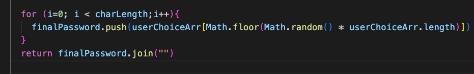

## Title of the project

Password Generator

## Decsription of the project

This challenge requires us to build a logic inside the `function generatePassword()`by creating the function itself first.An array which will store the list of numbers ,uppercase letters, lowercase letters and special characters.Additionally, it will also require if statement,for loop so, that user should be able to sucessfully generate random password based on the criteria selected which is stored in `userChoiceArr`.isNaN() function determines whether a value is `NaN`.When user enters any value `less than 8 or greater than 128 or not a number` should receive an alert which should be the expected result.`Math.random() and Math.floor()` method generates the random password and will store the final password in `finalPassword` array. HTML,CSS and some javascript starter code is provided by UC Berkely extension.

## User Story

```
AS AN employee with access to sensitive data
I WANT to randomly generate a password that meets certain criteria
SO THAT I can create a strong password that provides greater security
```

## Acceptance Criteria

```
GIVEN I need a new, secure password
WHEN I click the button to generate a password
THEN I am presented with a series of prompts for password criteria
WHEN prompted for password criteria
THEN I select which criteria to include in the password
WHEN prompted for the length of the password
THEN I choose a length of at least 8 characters and no more than 128 characters
WHEN asked for character types to include in the password
THEN I confirm whether or not to include lowercase, uppercase, numeric, and/or special characters
WHEN I answer each prompt
THEN my input should be validated and at least one character type should be selected
WHEN all prompts are answered
THEN a password is generated that matches the selected criteria
WHEN the password is generated
THEN the password is either displayed in an alert or written to the page
```

**Screenshot of for loop to randomly generate password based on user inputs**


## Links

[Github URL](https://github.com/ashachakre0906/Password-Generator)<br>
[Live URL](https://ashachakre0906.github.io/Password-Generator/)<br>

## Built with

- HTML
- CSS
- Javascript

## What I learned

- How to write Javascript code for Password generator functionality
- Create Function, If statememt,For loop,Comparison and logical operators
- Math.random() used with Math.floor() used to return random characters.

### Useful resources

- [w3schools](https://www.w3schools.com/js/default.asp)
- [MDN](https://developer.mozilla.org/en-US/docs/Web/JavaScript/Reference/Functions)

## Author

Starter code given by UC Berkely Extension

## License

Licensed under the [MIT](https://choosealicense.com/licenses/mit/) license.

Copyright (c) [2022] [Asha Chakre]

Permission is hereby granted, free of charge, to any person obtaining a copy
of this software and associated documentation files (the "Software"), to deal
in the Software without restriction, including without limitation the rights
to use, copy, modify, merge, publish, distribute, sublicense, and/or sell
copies of the Software, and to permit persons to whom the Software is
furnished to do so, subject to the following conditions:

The above copyright notice and this permission notice shall be included in all
copies or substantial portions of the Software.

THE SOFTWARE IS PROVIDED "AS IS", WITHOUT WARRANTY OF ANY KIND, EXPRESS OR
IMPLIED, INCLUDING BUT NOT LIMITED TO THE WARRANTIES OF MERCHANTABILITY,
FITNESS FOR A PARTICULAR PURPOSE AND NONINFRINGEMENT. IN NO EVENT SHALL THE
AUTHORS OR COPYRIGHT HOLDERS BE LIABLE FOR ANY CLAIM, DAMAGES OR OTHER
LIABILITY, WHETHER IN AN ACTION OF CONTRACT, TORT OR OTHERWISE, ARISING FROM,
OUT OF OR IN CONNECTION WITH THE SOFTWARE OR THE USE OR OTHER DEALINGS IN THE
SOFTWARE.
